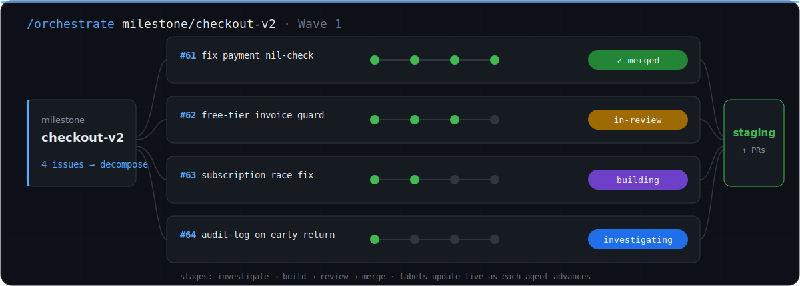

<div align="center">


<h1>ForgeDock</h1>

<p><strong>Deterministic orchestration for autonomous software engineering.</strong></p>

<p>LLMs generate the code. ForgeDock owns everything else — <strong>state, scheduling, recovery, review, and memory</strong> — as durable, inspectable structure on the GitHub you already have. Issues are the queue. PRs are the ledger. Annotations are the memory. Point it at an issue and get a merged, reviewed PR; point it at a <strong>milestone</strong> and get parallel pipelines with conflict-aware scheduling.</p>

<a href="LICENSE"></a>
<a href="https://github.com/RapierCraftStudios/ForgeDock/stargazers"></a>
<a href="https://docs.anthropic.com/en/docs/claude-code"></a>
<a href="https://www.npmjs.com/package/forgedock"></a>
<a href="https://www.npmjs.com/package/forgedock"></a>
<a href="https://github.com/RapierCraftStudios/ForgeDock/pulls"></a>
<a href="https://github.com/sponsors/RapierCraftStudios"></a>

</div>

<br />

<div align="center">


<p><em><strong>One <code>/orchestrate</code> runs a whole milestone.</strong> Agents pick up issues in parallel, drive each through investigate → build → review, and flip the GitHub labels to <code>merged</code> — live.</em></p>

</div>

**This repository builds itself with ForgeDock.** In its first 30 days (June 4 → July 4, 2026): **693 issues filed, 605 closed, 603 PRs merged — median 56 minutes from open to merged-and-closed.** 57% of those issues were filed by the pipeline itself; 49% are findings its own review agents raised, filed, and then fixed. Every run leaves a public audit trail — [click through the receipts](#watch-the-machine-work), or count them yourself:

```bash
gh issue list -R RapierCraftStudios/ForgeDock --state closed --limit 1000 --json number --jq 'length'
```

**A single run, up close** — a real one, [issue #1230](https://github.com/RapierCraftStudios/ForgeDock/issues/1230):

```console
$ /work-on #1230        "orchestrate: Layer 5 co-change signal is dead code"

  ✓ investigate    CONFIRMED/HIGH — feature shipped 3h earlier (PR #1204) reads a
                   never-populated variable; the co-change query can never fire
  ✓ build          fix branch, 1 file
  ✓ review         caught a defect in the fix itself: stray backticks in the grep
                   meant every git-log pathspec silently matched zero commits —
                   "the fix would not have actually worked." Corrected.
  ✓ merged         30m 37s → staging

  filed by the pipeline's own staging review. fixed before a human read it.
```

### Try it in 30 seconds — on a throwaway repo, nothing to lose

```bash
npx forgedock demo     # spins up a risk-free demo repo and shows you the pipeline end to end
```

Ready to use it for real? **`npx forgedock`** walks you through one continuous setup: it checks your environment, installs the slash commands, reads your repo, and hands you a single annotated `forge.yaml` to review — you press Enter once.

> ⭐ **If ForgeDock saves you time, [star the repo](https://github.com/RapierCraftStudios/ForgeDock/stargazers)** — it's the whole marketing budget.

---

**Your AI coding agent forgets everything after every session.** It re-explores the codebase from scratch, re-makes mistakes that were already fixed, and has no idea why the code it's touching looks the way it does. ForgeDock fixes that by making **GitHub itself the memory** — every pipeline stage writes structured findings that every later agent reads.

## Without ForgeDock vs. With ForgeDock

| Without ForgeDock | With ForgeDock |
|---|---|
| Agent starts every session blind — no context from prior work | Agent reads structured investigation, root cause, and history straight from GitHub |
| The same bugs get reintroduced across PRs | Review agents surface known pitfalls from past PRs *before* you commit |
| A crash or compaction loses the run | State lives on GitHub and in an event-sourced run log — the pipeline resumes where it stopped |
| You write the issue, plan the fix, open the PR, and review it | `/work-on #42` → investigated, built, reviewed, merged |
| Review depends on whoever has capacity | 9 domain-specialist agents (security, billing, DB, concurrency…) review every PR |
| One task at a time, serialized by your attention | `/orchestrate` runs a whole milestone — many issues in parallel, each its own full pipeline |

---

## The idea in one paragraph

AI agents have **no lookback**. They don't know a function was shaped by a bug fix in #347, that an approach was tried and reverted in PR #891, or that three other files need the same change. Context window isn't the bottleneck — **memory is.** But GitHub already stores everything an agent needs: commits, PRs, issues, blame, cross-references. It's a citation graph; agents just don't use it as one. ForgeDock makes every stage write **machine-readable annotations** to issues and PRs, and every downstream agent read them. The `gh` CLI becomes the query interface to institutional memory. The result: agents that follow structured data, not vibes.

```
┌──────────────────────────────────────────────────────────────────┐
│                     GITHUB (Knowledge Graph)                     │
│                                                                  │
│  Issues:  FORGE:INVESTIGATOR → FORGE:CONTEXT → FORGE:ARCHITECT   │
│           → FORGE:TRAJECTORY (the run's full audit trail)        │
│  PRs:     FORGE:BUILDER → structured review FINDING blocks       │
│  Links:   git blame → commit → PR → issue → related issues       │
│                                                                  │
│  Every agent reads this. Every agent writes to it.               │
│  Nothing is lost between conversations.                          │
└──────────────────────────────────────────────────────────────────┘
```

---

## Watch the machine work

Not a staged demo — these are real, public runs on this repository. Open any of them and read the full trail:

- **[#1230](https://github.com/RapierCraftStudios/ForgeDock/issues/1230)** — the pipeline's staging review caught dead code in a feature the pipeline had shipped three hours earlier; review then caught a bug in the fix itself. Intent to merged: **30 minutes**.
- **[#1172](https://github.com/RapierCraftStudios/ForgeDock/issues/1172)** — review found an `ANTHROPIC_API_KEY` exfiltration path in the headless runner (an in-process file read bypassed the env scrub), with exact line evidence. Fixed and merged in **18 minutes**, with regression tests. A later re-review found a second-order bypass of the first fix ([#1243](https://github.com/RapierCraftStudios/ForgeDock/issues/1243)) — the pipeline red-teams its own fixes.
- **[#952](https://github.com/RapierCraftStudios/ForgeDock/issues/952)** — the investigator closed the pipeline's *own proposal* as INVALID with receipts: the deliverable had already shipped weeks earlier. Zero code written, 34 minutes, full explanation.
- **[#1256](https://github.com/RapierCraftStudios/ForgeDock/issues/1256)** — decomposition that respects the existing graph: it created only the two net-new sub-issues no open issue already claimed, then sequenced three existing issues into the dependency order.
- **[#1322](https://github.com/RapierCraftStudios/ForgeDock/issues/1322)** — a heavyweight feature (the durable execution engine itself): 9 TDD tasks, whole-branch review caught two Criticals pre-merge, merged in **under 2 hours**.

And the part that makes it compound — the context phase citing past bugs *by number* before a line is written (from [#1196](https://github.com/RapierCraftStudios/ForgeDock/issues/1196)):

> "`commands/orchestrate.md` has a dense review-finding history from PR #1081/#1107/#1126… associative-array declaration mistakes (#1113), array-element removal via pattern substitution corrupting partial matches (#1108)… the new Layer 5 subsection should not introduce a competing edge-direction convention that could reintroduce a cycle class."

> Numbers on this page are point-in-time (2026-07-04), from this repository's first 30 days of dogfooding. A reproducible cost-per-issue benchmark is a hard gate on our own launch plan — [#1264](https://github.com/RapierCraftStudios/ForgeDock/issues/1264): no estimated efficiency claims.

---

## Orchestrate an entire milestone

`/work-on` ships one issue. **`/orchestrate` ships a milestone.** It decomposes the milestone into dependency-ordered waves and runs a full `/work-on` pipeline on each issue **in parallel** — investigating, building, reviewing, and merging many at once, while GitHub labels track every agent's state live. On this repo's record day, that meant **29 issues taken to merged inside a single hour**.

Scheduling is conflict-aware before it is parallel. Five detection layers decide what may run concurrently: same-file overlap, directory proximity, shared-module fan-in, a conservative fallback when file extraction is low-confidence, and **historical co-change coupling mined from `git log`** — files that changed together in the past are assumed to conflict now. Database-touching issues are always serialized. The resulting graph is cycle-checked (Kahn's algorithm) and executed in topologically sorted waves; overlapping work is expressed as ordinary `Depends on #N` edges anyone can read.

<div align="center">

</div>

```bash
/orchestrate milestone/checkout-v2     # decompose → conflict-aware waves → merged PRs
```

---

## How it works

Each stage reads the structured output of the stages before it and writes its own findings back:

```
Issue → Investigate → Context → Architect → Build → Quality Gate → Review → Merge
              └──────────── each stage reads & writes GitHub ────────────┘
```

| Stage | Reads | Writes |
| --- | --- | --- |
| **Investigate** | Issue body, `git blame`, related issues/PRs | `FORGE:INVESTIGATOR` — verdict, root cause, affected files, severity |
| **Context** | Historical findings from related PRs, known pitfalls | `FORGE:CONTEXT` — institutional memory for this module |
| **Architect** | Investigation + context | `FORGE:ARCHITECT` — ordered plan, code paths, risks |
| **Build** | Everything above | `FORGE:BUILDER` — branch, commits, files changed |
| **Quality Gate** | Builder output, domain-specific checks | gate results, recorded in the run's trajectory |
| **Review** | PR diff, contract, gate results | `FORGE:REVIEW_STARTED` on the issue; per-agent findings as structured `FINDING` blocks on the PR |
| **Close** | All of the above | `FORGE:TRAJECTORY` — the full audit trail of the run |

**GitHub as the database.** Every annotation is wrapped in an HTML comment (`<!-- FORGE:INVESTIGATOR -->`) that makes it machine-parseable. When an agent starts — even in a brand-new conversation after compaction — it queries the issue via `gh` and reconstructs full context from these tags. Workflow labels (`workflow:investigating`, `workflow:in-review`, `workflow:merged`…) track state, and the pipeline resumes from whatever state GitHub reports. The annotation format is an open standard — see the [FORGE Annotation Protocol](docs/spec/forge-protocol-v1.md).

**Durable by design.** Headless runs are backed by a real execution engine, not prompt-hope: every phase transition is appended to an event-sourced, crash-safe run log, mirrored to the issue as a compact `FORGE:STATE` index, and guarded by leases so two agents can never own the same issue. Kill the process mid-run and restart it — the engine reconciles local state against GitHub (GitHub wins), adopts branches and PRs that already exist instead of re-running the LLM, and escalates to `needs-human` after bounded retries instead of looping. Phase selection is a pure rule-based state machine: **the engine, not the model, decides what happens next.** The headless core shipped in [PR #1326](https://github.com/RapierCraftStudios/ForgeDock/pull/1326); wiring the interactive path onto the same engine is in progress ([#1323](https://github.com/RapierCraftStudios/ForgeDock/issues/1323)–[#1325](https://github.com/RapierCraftStudios/ForgeDock/issues/1325)).

**Domain-specialist review.** Every PR is reviewed by agents with deep, narrow expertise — Security, Auth & Access Control, Billing Integrity, Database, Concurrency, Frontend, API, Performance, Infrastructure. Findings carry a confidence level, and a **reproduction gate** keeps them honest: a finding only blocks if the reviewer traced an actual code path or input that triggers it — pattern-match suspicions are downgraded, not merged into noise. Findings above the severity threshold are **automatically filed as new issues** that enter the same pipeline: on this repo, that loop produced 49% of all issues ever filed.

**It measures itself.** `/pipeline-health` correlates every prompt change against review-finding rates, build failures, and manual fix-up commits, then files its own report — including failing grades — as an issue. `/autopilot` pulls production signals (errors, CI failures, stale issues, analytics), files issues from them, and optionally runs `/work-on` on the top ones. The pipeline also invalidates its own bad ideas: proposals that turn out to be already-shipped or wrong are closed `workflow:invalid` with the reasoning attached ([example](https://github.com/RapierCraftStudios/ForgeDock/issues/952)).

---

## Built for the ways agents fail

Every mechanism above exists because autonomous agents fail in predictable ways. The skeptics are right about the failure modes — the answer is structure, not optimism:

| "We've all seen this go wrong…" | The mechanism |
| --- | --- |
| Parallel agents just turn typing time into *reading* time | Review is a pipeline stage: domain specialists with confidence ratings and a reproduction gate — not a pile of raw diffs |
| Agents game their own checks (or delete the tests) | Builders never grade their own work — the quality gate and reviewers are separate agents reading the diff cold |
| Third retry = increasingly creative excuses | Engine-owned state machine: bounded retries, then escalation to `needs-human` |
| One runaway agent wrecks the codebase | 1 issue = 1 agent, bounded by decomposition; conflict-aware scheduling; isolated worktrees |
| No institutional memory — "it can't read the Slack thread from 2023" | Every run writes citable annotations to GitHub; the context phase quotes past bugs by number |
| No way to tell when an agent drifts | A `FORGE:TRAJECTORY` receipt on the issue records what every phase actually did |
| Humans rubber-stamp 95%-good output | Specialist review raises the floor *before* a human looks at the PR |
| The economics are opaque | ForgeDock runs on your existing Claude account — it resells no compute and takes no per-task cut. Cost-per-issue benchmarks are tracked in the open ([#1264](https://github.com/RapierCraftStudios/ForgeDock/issues/1264)) |

---

## Commands

**The core loop:**

| Command | What it does |
| --- | --- |
| **`/work-on`** | Full issue lifecycle: investigate → build → quality gate → review → merge |
| `/orchestrate` | A whole milestone in parallel — conflict-aware waves, one pipeline per issue |
| `/issue` | Creates pipeline-ready GitHub issues |
| `/milestone` | Create, manage, and ship milestones |
| `/review-pr` | Context-aware PR review with domain-specialist agents |
| `/quality-gate` | Pre-commit checks, gated by the domains your change actually touches |
| `/test-gate` | Acceptance verification against running code before anything deploys |

**Observe & recover** — the durable-state story, as commands:

| Command | What it does |
| --- | --- |
| `/pipeline-status` | Fleet view of every in-flight issue, straight from workflow labels |
| `/pipeline-resume` | Resume an interrupted run from whatever state GitHub reports |
| `/diagnose` | Trace why a run failed, from its annotations |
| `/explain` | Translate the FORGE annotations on any issue into plain language |
| `/replay` | Replay a past run's full audit trail |
| `/changelog` | Release notes assembled from merged PRs and trajectory receipts |

**Ops:**

| Command | What it does |
| --- | --- |
| `/deploy-info` | Staging vs. main diff with risk assessment |
| `/rollback` | Automated revert PR for production incidents |
| `/autopilot` | Production signals → triaged issues → fixes |
| `/security-audit` | Multi-phase security posture audit |
| `/cleanup` | Sweeps stale issues, branches, worktrees |

More ship today (web-property analytics, browser QA sweeps, self-benchmarking) — see the [full command reference](docs/site/command-reference.md). A leaner, tiered install that keeps the core loop front and center is planned in [#1257](https://github.com/RapierCraftStudios/ForgeDock/issues/1257).

---

## Install

**Requirements:** [Claude Code](https://docs.anthropic.com/en/docs/claude-code) · [GitHub CLI](https://cli.github.com/) (authenticated) · Node.js ≥ 18.

```bash
npx forgedock          # checks your environment, installs the commands, detects your repo, and hands you a reviewed forge.yaml
```

One command does everything: it checks your environment, installs the slash commands into Claude Code, detects your repo (owner, branches, paths), and hands you a single annotated `forge.yaml` to review — press Enter to accept. Run `npx forgedock init` any time afterward to re-generate the config only.

Installing also registers a SessionStart hook, so every Claude Code session
in a forge-managed directory starts already knowing ForgeDock runs it.
Per-directory control: `npx forgedock enable` / `disable` / `status`.

Then just open Claude Code and run `/work-on <issue>`.

> **Cost:** ForgeDock is free and open-source. It orchestrates sessions on **your** Claude account — no compute resold, no per-task markup. A typical `/work-on` run on a straightforward bug costs about what a 15–20 minute manual Claude Code session does.

<details>
<summary><strong>Other install options & commands</strong></summary>

**Claude Code plugin marketplace** (Claude Code v2.1.143+):

```
/plugin marketplace add RapierCraftStudios/ForgeDock
/plugin install forgedock@forgedock
```

Commands then appear as `/forgedock:work-on`, etc. You still run `npx forgedock init` to generate `forge.yaml`.

**Headless / CI:** the pipeline also runs outside Claude Code. `npx forgedock run work-on <issue> --dry-run` previews the assembled prompt and tool plan; with an `ANTHROPIC_API_KEY`, `npx forgedock run` drives the same command specs through a hardened tool-use loop, and `npx forgedock run-issue <issue>` executes them on the durable engine (event-sourced run log, leases, crash-safe resume).

**Maintenance:**

```bash
npx forgedock update      # relink commands + refresh the SessionStart hook
npx forgedock enable      # turn ForgeDock on for this directory
npx forgedock disable     # turn ForgeDock off for this directory
npx forgedock status      # show ForgeDock's state for this directory
npx forgedock doctor      # installation health check with fix hints
npx forgedock uninstall   # remove commands, the hook, and tracked copies
npx forgedock help        # show everything
```

> Running `npx forgedock` from *inside* this repo uses the local working tree. From your own project, use `npx forgedock@latest` to pin the published release.

</details>

---

## For companies

The core is AGPL-3.0 and stays that way: engineers run the full pipeline on their own Claude account, forever free.

Two things are for sale:

- **A [commercial license](COMMERCIAL-LICENSE.md)** — for organizations that need ForgeDock inside proprietary workflows or products without AGPL copyleft obligations. Contact [licensing@rapiercraft.studio](mailto:licensing@rapiercraft.studio).
- **The fleet layer** *(in development)* — org-wide observability over every pipeline run: the receipts on this page, live, across all your repos, plus policy controls and audit-grade provenance for autonomous merges. We're onboarding a small group of design partners — see [ForgeDock for Companies](docs/site/for-companies.md) for details and intake.

---

## Where it's going

Month one built the execution layer. The open roadmap — tracked in the [five-foundations epic (#1320)](https://github.com/RapierCraftStudios/ForgeDock/issues/1320) — is about earning trust while unattended:

1. **Durability** — engine-owned state instead of prose-owned state. Headless core shipped ([PR #1326](https://github.com/RapierCraftStudios/ForgeDock/pull/1326)); interactive wiring in progress.
2. **Verification** — an outcome-based acceptance gate and a graded eval corpus, so "done" is machine-checkable before anything claims success. Per-release pipeline scorecards are published in [`docs/eval/`](docs/eval/README.md); model upgrades follow the [model-release playbook](docs/articles/model-release-playbook.md).
3. **Learning** — per-codebase memory that compounds across runs.
4. **Economics** — per-run cost accounting and risk×cost dispatch decisions.
5. **Provenance** — signed, replayable records of every autonomous change.

Marketing is held to the same standard: [#1264](https://github.com/RapierCraftStudios/ForgeDock/issues/1264) gates our own launch on measured cost-per-issue benchmarks — no estimated claims.

---

## Show your support

Using ForgeDock in your pipeline? Add the badge — each one is a backlink and a signal to other developers:

```markdown
[](https://github.com/RapierCraftStudios/ForgeDock)
```

[](https://github.com/RapierCraftStudios/ForgeDock)

---

## Star History

<div align="center">

<a href="https://star-history.com/#RapierCraftStudios/ForgeDock&Date">
  <picture>
    <source media="(prefers-color-scheme: dark)" srcset="https://api.star-history.com/svg?repos=RapierCraftStudios/ForgeDock&type=Date&theme=dark" />
    
  </picture>
</a>

</div>

---

## Docs & community

- [GitHub Is Already Your Agents' Memory](docs/site/github-is-the-memory.md) — the canonical argument: why GitHub is the right place for agent memory, how FORGE annotations make it machine-readable, and how to adopt the protocol without ForgeDock
- [Getting Started in 5 Minutes](docs/site/getting-started.md)
- [How the Knowledge Graph Works](docs/site/how-it-works.md)
- [What Are Those FORGE Comments?](docs/site/annotations-explained.md) — 2-minute explainer for annotations you meet in the wild
- [FORGE Annotation Protocol](docs/spec/forge-protocol-v1.md) — the open standard for AI context passing (CC-BY-4.0)
- [ForgeDock vs. Manual Claude Code Workflows](docs/site/vs-manual-workflows.md)
- [ForgeDock vs. DeepWiki, AGENTS.md, and Cursor Memories](docs/comparison.md)
- [Command Learning Path](docs/site/command-learning-path.md) — which commands to learn first
- [Complete Command Reference](docs/site/command-reference.md)
- [Troubleshooting & Recovery](docs/site/troubleshooting.md)
- [Pipeline Eval Scorecards](docs/eval/README.md) — per-release published results for every model/Claude Code upgrade
- [Model-Release Upgrade Playbook](docs/articles/model-release-playbook.md) — how to validate a new model before adopting it

**Contributing:** PRs welcome — every change goes through a PR, tested against 3+ scenarios, using conventional commits (`fix(command):`, `feat(command):`). **License:** [AGPL-3.0](LICENSE) — free to use, modify, and distribute; network use of modifications must be open-sourced under the same license. Commercial licenses are available for proprietary use — see [COMMERCIAL-LICENSE.md](COMMERCIAL-LICENSE.md).

<div align="center">
<br />
<p>Built and dogfooded in production by <a href="https://github.com/RapierCraftStudios">RapierCraft Studios</a>.</p>
</div>
